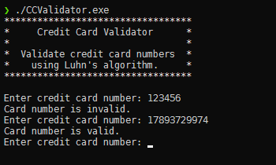
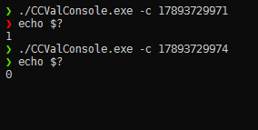
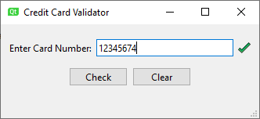
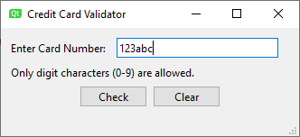

# CreditCardValidator

Toy project for credit card number validation using Luhn's algorithm.
This app can be used through a command line interface, a console UI, or a graphical UI.

## Screenshots

## Usage
#### Console UI
- enter a number to validate
- press `Ctrl+C` to abort

#### Command Line Interface
- run application with `-c` option and the card number as parameter
- the application exists with return code 0 if the number was valid, and return code 1, otherwise

